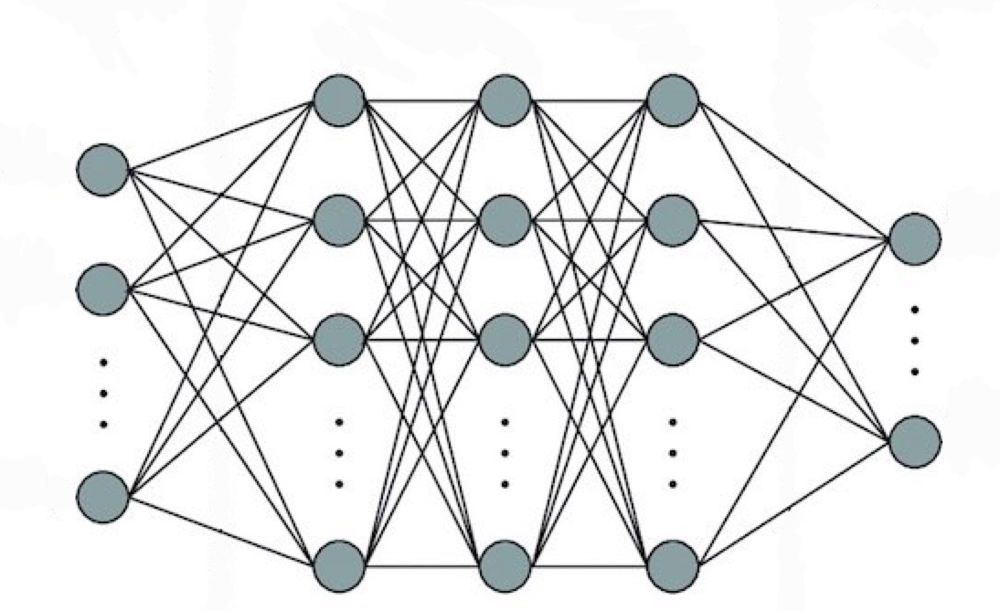
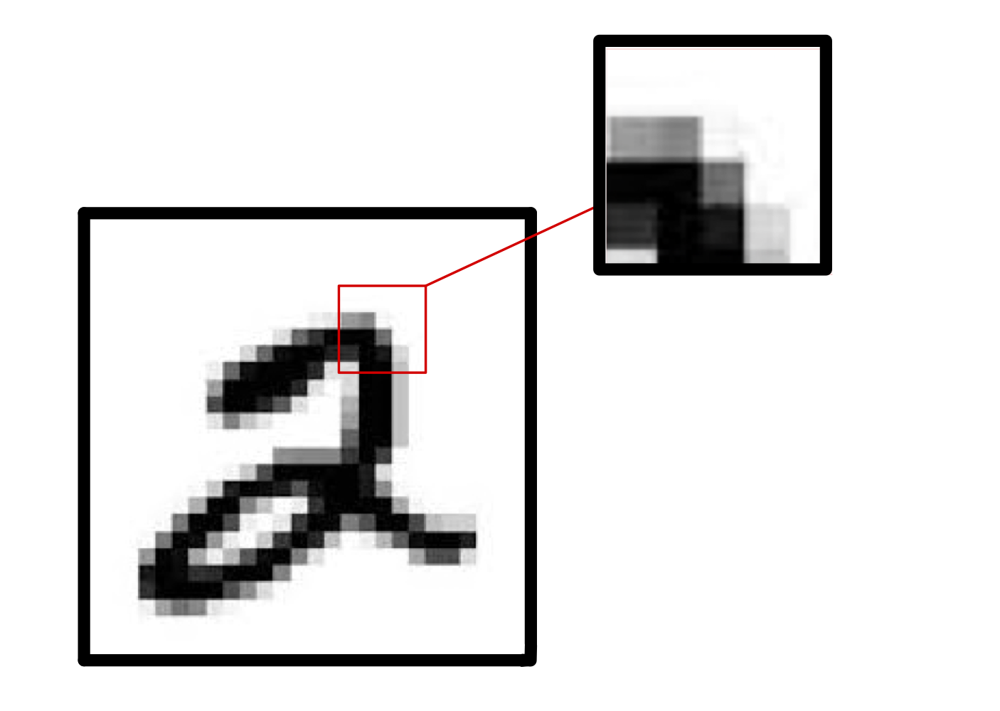
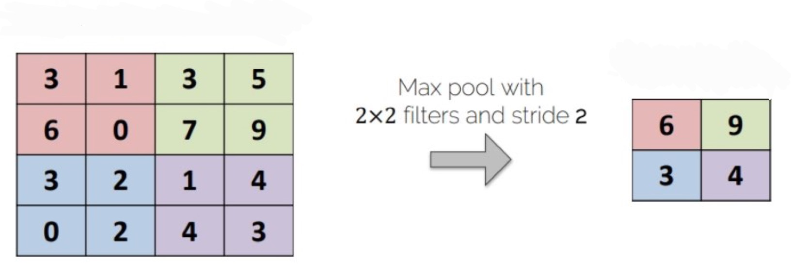
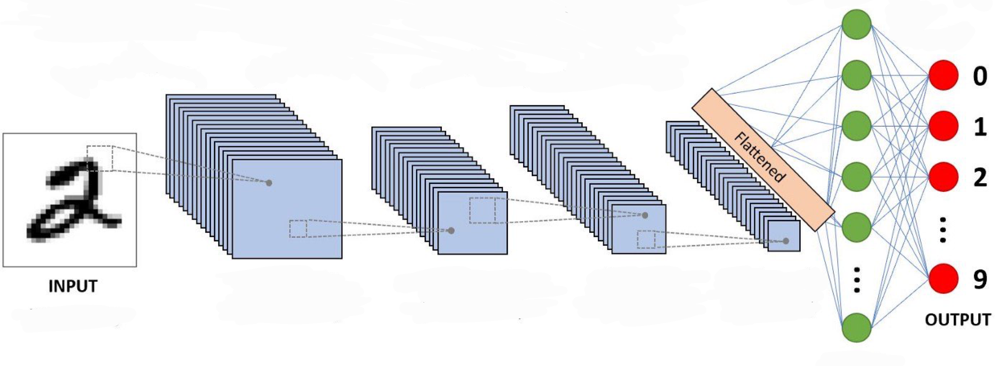

```{r setup, include = FALSE}
knitr::opts_chunk$set(echo = TRUE)
library(reticulate)
library(knitr)
knitr::knit_engines$set(python = reticulate::eng_python)
use_python('/Users/apgillock/Library/r-miniconda/envs/r-reticulate/bin/python')
```

# Introduction

```{r, align = 'center', echo = FALSE}

```

The Modified National Institute of Standards and Technology (MNIST) dataset is a large database composed of 70,000 handwritten digits. Each 'image' is a 28x28 dataframe containing single grayscale values in each element of the matrix. This database is frequently used to understand image classification machine learning models through pattern recognition. The goal of this project is to design a convolutional neural network that classifies the MNIST test dataset with 99% or greater accuracy. 

```{python}
import pandas
import numpy as np
import tensorflow as tf
import matplotlib.pyplot as plt
```

I will begin this exercise by downloading the MNIST dataset from the keras library. A few other housekeeping things must be accounted for, such as normalizing the gray-scale values prior to analysis and reshaping our training/testing data for the tensorflow model. Tensorflow requires us to include a third dimension for our images, but since we are dealing with gray-scale (instead of color) we can set this value to be 1. Finally, we obtain the shape of each image that will be ran through the model.

```{python}
mnist = tf.keras.datasets.mnist # load in data

(x_train, y_train),(x_test, y_test) = mnist.load_data()

x_train, x_test = x_train / 255.0, x_test / 255.0 # normalize grayscale values

# get lengths of train/test
ndata_train = x_train.shape[0] # = 60000
ndata_test = x_test.shape[0] # = 10000

# tensorflow requires us to include 3rd dimension for color (1)
x_train2 = x_train.reshape((ndata_train,28,28,1))
x_test2 = x_test.reshape((ndata_test,28,28,1))

xshape = x_train2.shape[1:4] # we only need the image dimensions for the model
```

# Designing the Network Architecture

Convolutional neural networks (CNNs) are often used in models that take images as input. They work by applying a set of filters to the image, which can be thought of as a small subset of the original photo. Similarity scores (the dot product of filter and that portion of the image) are computed between the filter and image as the filter is moved across different positions in the image. An example of a filter is seen below in Figure 1.

```{r, fig.cap = 'Example of a small filter applied to each region of the original image', align = 'center', echo = FALSE}

```

The application of filters results in significantly more data which can increase processing times for the network. In order to 'fix' this problem, we can introduce a max pooling layer, which functions similar to a filter. The max pool filter moves across the similarity score matrix, but rather than computing the dot product, the largest value within the filter is used to define that whole section of similarity. As a result, we decrease the number of input neurons required by the dense neural network and identify the general vicinity of corresponding filter-image similarities. The output of the max pool layer is passed into a dense neural network to complete the classification. The final output of the model is a vector of 10 probabilities, one for each digit 0-9. The index with the largest probability is the number predicted by the network. A visualization of this process can be seen below in Figure 2.

```{r, fig.cap = 'Visualization of max pool layer following a convolutional layer', align = 'center', echo = FALSE}

```

Using this information, I will now develop my own CNN with the goal of achieving 99% or greater classification accuracy on the MNIST test dataset. I began this process by fitting different combinations of convolution and max pool layers to the training set of 60,000 images. A validation split of 0.2 was used to prevent overfitting of the model. For the convolutional layers, I found that 2 layers of small filters, a max pool layer, another convolutional layer, and a final max pool layer present us with the largest validation accuracy. The first convolutional layer is composed of 20 5x5 filters and a ReLU activation. The second convolutional layer has 20 2x2 filters and a ReLU activation. The first max pool layer uses a pool size of 2x2 with a stride of 2 to prevent overlap. The final convolutional layer contains 50 2x2 filters and a ReLU activation. The final max pool layer once again uses a pool size of 2x2 and a stride of 2. The output of the final max pool layer is fed into multiple dense and dropout layers before outputting the final classification of the image. Once the model achieved greater than 99% validation accuracy, we retrained the same model using the entire training set. A summary of my model can be seen below.  Additionally, Figure 3 displays a completed CNN similar to my own, which helps with a visualization of the model.

```{python}
NNmodel = tf.keras.models.Sequential()
NNmodel.add(tf.keras.layers.Conv2D(filters = 20, kernel_size = (5,5), activation = tf.nn.relu, 
input_shape = xshape))
NNmodel.add(tf.keras.layers.Conv2D(filters = 20, kernel_size = (2,2), activation = tf.nn.relu))
NNmodel.add(tf.keras.layers.MaxPooling2D(pool_size = (2, 2), strides = 2))
NNmodel.add(tf.keras.layers.Conv2D(filters = 50, kernel_size = (2,2), activation = tf.nn.relu))
NNmodel.add(tf.keras.layers.MaxPooling2D(pool_size = (2,2), strides = 2))
NNmodel.add(tf.keras.layers.Flatten())
NNmodel.add(tf.keras.layers.Dropout(rate = 0.4))
NNmodel.add(tf.keras.layers.Dense(128,activation=tf.nn.relu))
NNmodel.add(tf.keras.layers.Dropout(rate = 0.2))
NNmodel.add(tf.keras.layers.Dense(64,activation=tf.nn.relu, 
kernel_regularizer = tf.keras.regularizers.l1(0.0005)))
NNmodel.add(tf.keras.layers.Dense(10,activation=tf.nn.softmax))
```

```{python, echo = FALSE}
# reload saved model
NNmodel = tf.keras.models.load_model('materials/my_model', compile = False)
NNmodel.compile(optimizer='adam',
              loss='sparse_categorical_crossentropy',
              metrics=['accuracy'])
```

```{python}
NNmodel.summary()
```

```{r, fig.cap = 'Visualization of a CNN used to classify an image', align = 'center', echo = FALSE}

```

# Model Results

Now that we have determined a network architecture, we can evaluate the model. 

```{python}
NNmodel.evaluate(x_test2, y_test, verbose = 0)
```

The model correctly classifies 99.35% of images in the MNIST test set! Let's determine which images were classified incorrectly and try to see why the model was wrong.

```{python}
predicted = NNmodel.predict(x_test, verbose = 0) # obtain vector of probabilities for each image

def get_guess(predicted):
    '''this method takes all predicted probabilities and returns the predicted classification for each image'''
    guesses = []
    for i in predicted:
        guess = i.argmax()
        guesses.append(guess)
    return guesses

guesses = get_guess(predicted)

# get indexes of correctly classified images
correct = np.where(np.equal(guesses, y_test))
correct = correct[0].tolist()

# get indexes of misclassified images
incorrect = np.where(np.not_equal(guesses, y_test))
incorrect = incorrect[0].tolist()

print('Correct:', len(correct))
print('Incorrect:', len(incorrect))
```

Out of the 10,000 images in the test set, the model correctly classifies 9,935 images and misclassifies 65 images. Despite achieving greater than 99% classification accuracy, I'm left questioning how to further improve this model. 
Let's take a look at some of the images that are incorrectly classified to see the issues the model runs in to.

```{python, include = FALSE}
def plotter(image):
  # this function takes an image as input as returns a plot
  plt.pcolor(image, cmap = 'gray')
  plt.axis('off')
  plt.show
  return f
```

## Example 1
```{python, echo = FALSE}
fig_size = (5, 5)
f = plt.figure(figsize = fig_size)
i = 882
f = plotter(1 - x_test[i, ::-1, :])
pred = guesses[i]
actual = y_test[i]
print('Predicted:', pred)
print('Actual:', actual)
f
```

## Example 2
```{python, echo = FALSE}
fig_size = (5, 5)
f = plt.figure(figsize = fig_size)
i = 1260
f = plotter(1 - x_test[i, ::-1, :])
pred = guesses[i]
actual = y_test[i]
print('Predicted:', pred)
print('Actual:', actual)
f
```

## Example 3
```{python, echo = FALSE}
fig_size = (5, 5)
f = plt.figure(figsize = fig_size)
i = 1621
f = plotter(1 - x_test[i, ::-1, :])
pred = guesses[i]
actual = y_test[i]
print('Predicted:', pred)
print('Actual:', actual)
f
```

It appears that most of the misclassified numbers were poorly drawn or resemble other numbers based on their features. We can assume that our convolutional layers may pick up on patterns in these images that resemble patterns of other numbers. For example, a handwritten '6' may be classified as a '0' if the line above the enclosed area does not extend high enough. Additionally, we might see a '4' get classified as a '9' depending on the orientation of the image. When we examine correctly classified numbers, nearly all of these hand-drawn digits are clearly legible and distinguishable.

Given these observations, we can conclude that although the model may be improved, we will never achieve 100% classification accuracy on the test set. Since each digit is hand-drawn, there is too much variability between the neatness and structure in handwriting of the individuals used in the training and test set. 
